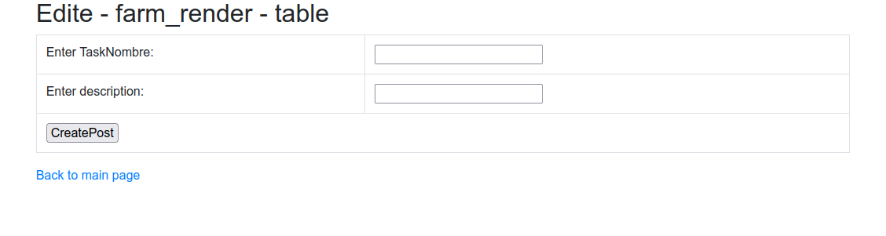

# test_farm_render
деплой в хероку  
https://fathomless-taiga-94631.herokuapp.com/login
 Вам нужно реализовать прототип рендер фермы на java. Прототип представляет из
себя клиент-серверное приложение. Данное приложение требуется в первую очередь
клиентам, которые хотят отслеживать статус своих задач на рендер ферме.

1. Клиент.  Консольное приложение со следующими возможностями
   o регистрация пользователя
   o создание новой задачи*
   o отображение списка созданных задач (id, status)
   o отображение истории смены статусов задачи
2. Сервер. Принимает от клиента запросы и обрабатывает их.
   o Регистрация пользователя с занесением его в базу данных.
   o Создание новой задачи для конкретного пользователя с занесением ее в
   базу данных.
   o Обработка запроса списка текущих задач.

*Задача - у нас задача, это запуск некого приложения на стороне сервера + запись в
базе данных об этом. Вы можете ограничиться только записью в базе данных.

После создания задачи ей присваивается статус RENDERING, по истечению
случайного количества времени от 1 до 5 минут она считается выполненной, и ей
присваивается статус COMPLETE.

По какому событию в клиенте будет обновляться список задач со статусами - выбор
за вами. Каким образом будет реализована связь между пользователем и задачами, а
также: будете ли вы реализовывать авторизацию пользователя, или будете иным
образом выбирать задачи пользователя - тоже выбор за вами.
 
Страница авторизации пользователя

 Список заданий

 Страница добавления задания

## Контакты для связи 
 arvikvan@gmail.com 
 @ArvikV

##Используемые технологии:
- Maven
- Hibernate
- PostgreSQL
- Spring MVC, Security, Boot

# farmrender
